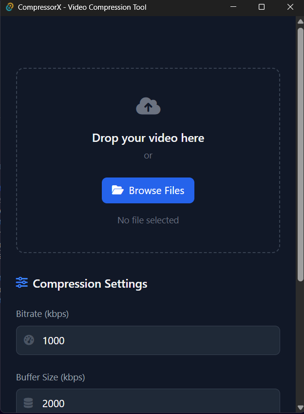
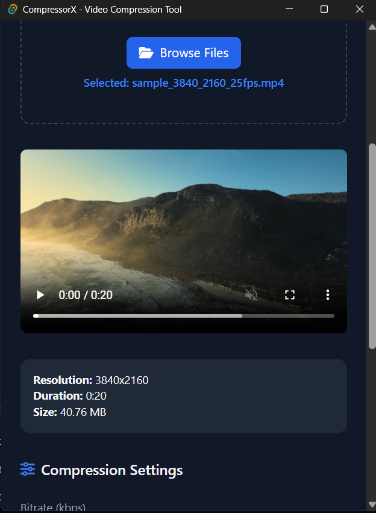
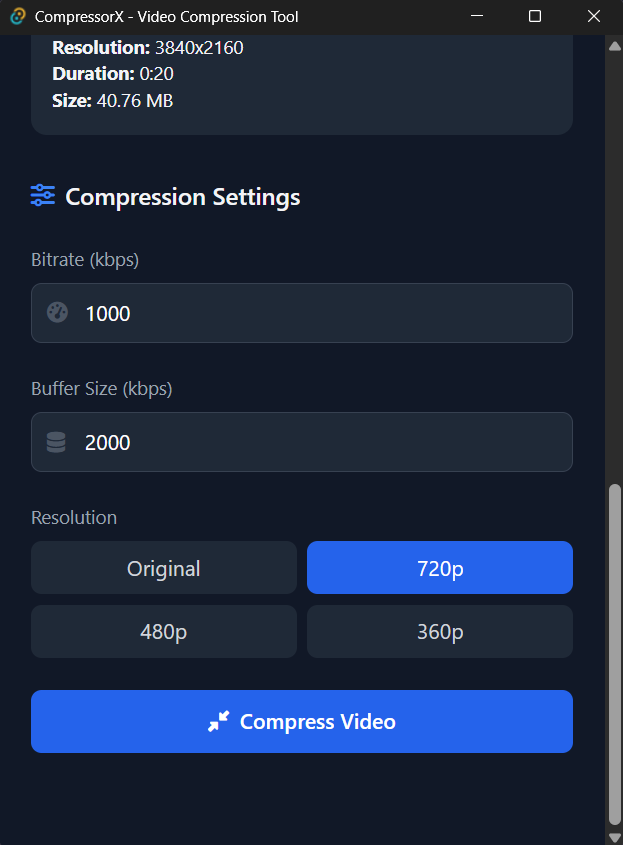
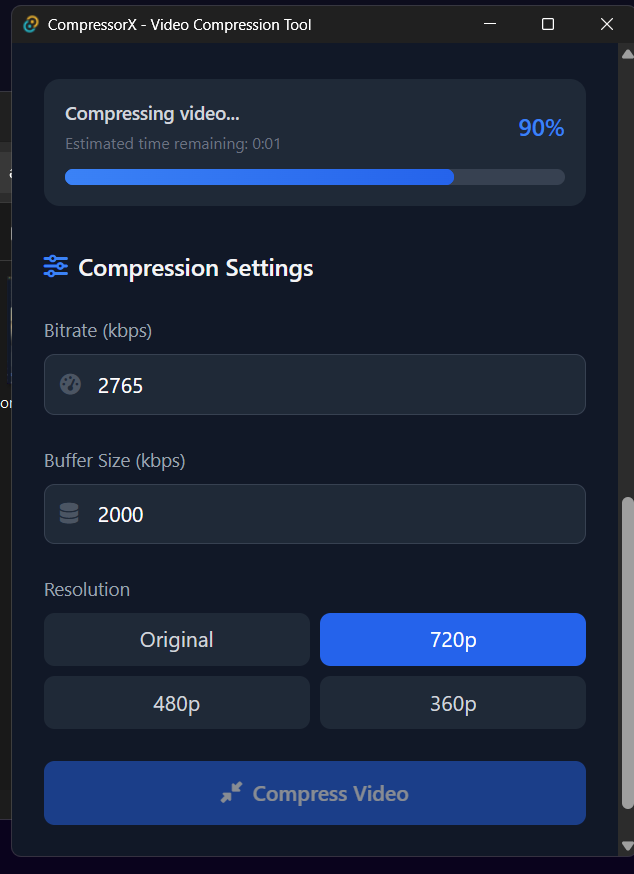
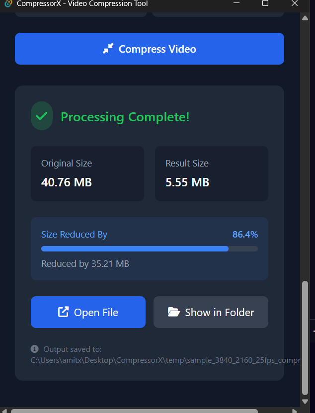

# 🎞️ CompressorX

**A fast, lightweight desktop video compressor built with Tauri (Rust) and TypeScript.**

---

## 🚀 About the Project

CompressorX is a desktop application I built to solve my own video compression needs while diving deeper into modern web technologies like Tauri, Rust, and TypeScript. It's designed to be efficient, easy to use, and beginner-friendly—even if you're not familiar with video compression tools.

---

## ✨ Features

- 🎥 **Drag & Drop Support** – Simply drag your video file into the app
- 📊 **Real-Time Progress** – Watch your compression in action
- 🎯 **Resolution Options** – Choose from Original, 720p, 480p, or 360p
- ⚙️ **Advanced Settings** – Customize bitrate and buffer size
- 🌙 **Sleek Dark UI** – Clean and modern interface
- 📈 **Compression Stats** – See detailed info about file size reduction
- 📁 **Easy File Access** – Open output files with a single click
- 🦀 **Built in Rust** – High performance, low resource usage
- 🎬 **Bundled with FFmpeg** – No external downloads required
- 💻 **Currently Windows Only** – Support for 64-bit Windows 10/11

---

## 🧱 Tech Stack

| Layer        | Tech                                  |
|--------------|----------------------------------------|
| **Frontend** | TypeScript, HTML, Tailwind CSS         |
| **Backend**  | Rust (via Tauri)                       |
| **Processing**| FFmpeg (integrated via Rust backend)  |

---

## 📁 Project Structure

```
CompressorX/
├── src/                # Frontend (TypeScript)
│   ├── handlers/       # UI events & logic
│   ├── services/       # FFmpeg interaction & file ops
│   ├── types/          # Type definitions
│   ├── utils/          # Helpers and utilities
│   ├── styles/         # Tailwind config & CSS
│   └── assets/         # Icons and static files
│
└── src-tauri/          # Backend (Rust + Tauri config)
    ├── src/            # Rust source
    ├── Cargo.toml      # Rust dependencies
    └── tauri.conf.json # Tauri app settings
```

---

## 🧰 Requirements

**To use the app (users):**
- Windows 10 or 11 (64-bit)

**To build from source (developers):**
- [Node.js](https://nodejs.org/) (v16+)
- [Rust](https://www.rust-lang.org/)
- [Git LFS](https://git-lfs.com/) (for FFmpeg binaries)

---

## 🛠️ Installation

### 🏁 Download Prebuilt App

Grab the latest Windows installer from the [Releases](https://github.com/yourusername/CompressorX/releases) page and run the `.msi` file.

### 🔧 Build from Source

1. **Install Git LFS**
   ```bash
   choco install git-lfs     # Or install from https://git-lfs.com/
   ```

2. **Clone the Repository**
   ```bash
   git lfs install
   git clone https://github.com/Amitminer/CompressorX.git
   cd CompressorX
   git lfs pull              # Pull FFmpeg binaries
   ```

3. **Install Node Dependencies**
   ```bash
   npm install
   ```

4. **Run in Dev Mode**
   ```bash
   npm run tauri dev
   ```

5. **Build for Production**
   ```bash
   npm run tauri build
   ```

Output will be available in `src-tauri/target/release`.

---

## 🧪 How to Use

1. Launch **CompressorX**
2. Drag & drop your video or click *Browse Files*
3. Pick a resolution
4. Optionally adjust bitrate & buffer size
5. Click **Compress Video**
6. Monitor progress and view stats
7. Open your compressed video instantly

---

## 📚 What I Learned

This project helped me grow in a lot of areas:

- TypeScript + Tailwind CSS workflows
- Rust's performance and safety benefits
- Cross-platform desktop development with Tauri
- How FFmpeg works under the hood
- Bridging TypeScript and Rust
- Clean UI/UX design for technical tools
- Writing clear documentation (like this!)

---

## 🖼️ UI Preview

### Home Screen


### File Upload


### Settings Panel


### Compression Progress


### Completion Screen



---

## 📄 License

This project is licensed under the **MIT License**. See the `LICENSE` file for details.

---